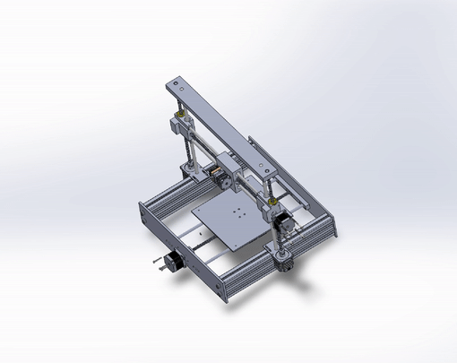

# Custom 3D Printer

A custom RepRap FDM 3D printer.

⚠️ Still under active development: Parts and documentation will change!

## V1.0

The first version is more like a proof of concept designed and made out of mostly scraped metal over the course of 3 month and took 2 month of tweaking and configuring, however it is fully functional and practical but there is more to enhance and improve.

    

# Specification

- build volume: 580mm x 485mm x 450mm

- 4 x TB6600HG Step Motor Driver NEMA23

- 4 x PHB57S 1.8 degree NEMA23 Stepper Motors (X,Y,Z)

- Arduino Mega 2560CH460

- Ramps 1.6

- lead screw 10x2 
  
- MK8 Extruder

- DRV8825 Step Motor Driver NEMA17 
  
- 2 x Opto Endstop and 1 x Mec Endstop

- MK3 HeatBed

- 12v and 24v power supply

# Firmware

Printer uses <b>Marlin 2.0x</b> firmware running on a Arduino Mega. The configuration changes have been applied into the configuration.h file and slic3r configs, you can find all configs in the config folder.

To control the machine and to stream the G-Code, Repetier-Host and slic3r has been used.

# Hardware Documentation

## Schematic and PCB Layout

- [schematic](electronics/schematic.pdf)
## Building InstructionsBuilding Instructions

    will make a build process for enhanced and better version.

# Printed Parts

# License

[CERN Open Hardware Licence version 2](license-cern_ohl_s_v2.txt)